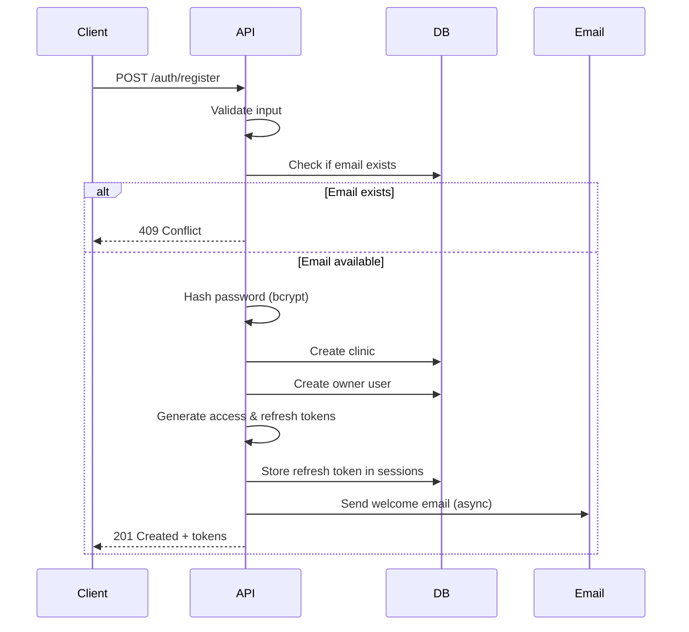
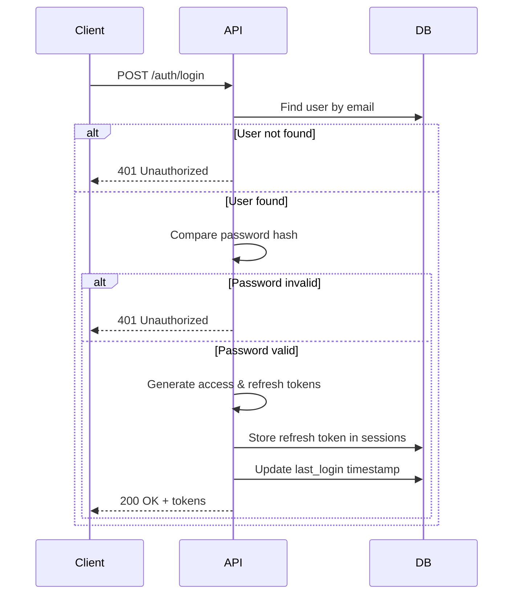
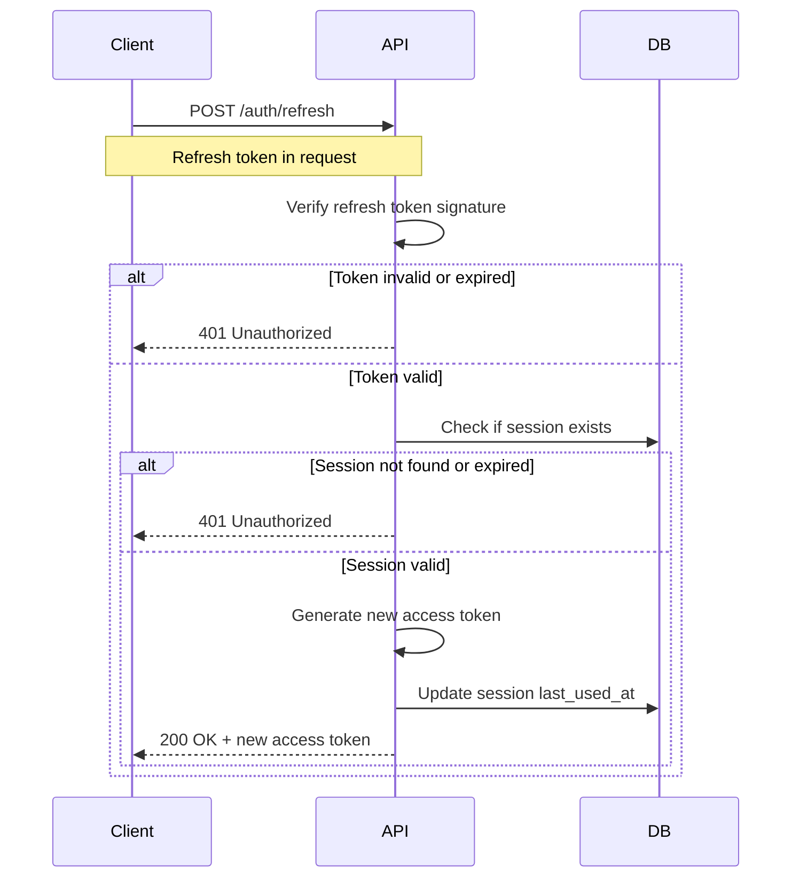
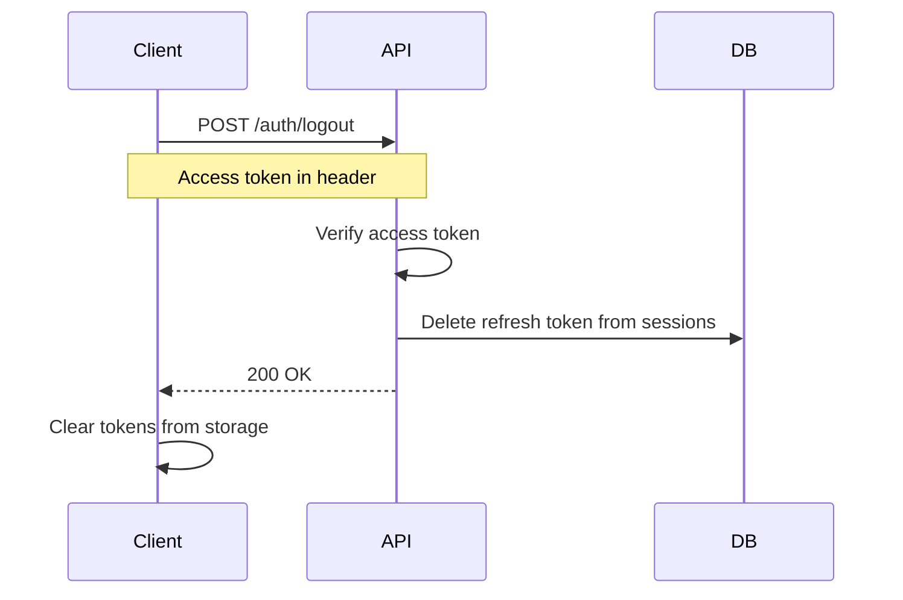

# Authentication Flow - JWT-Based

## Overview
The authentication system uses JSON Web Tokens (JWT) with access and refresh token strategy for secure, stateless authentication.

## Token Strategy

### Access Token
- **Purpose**: Short-lived token for API authentication
- **Lifetime**: 1 hour (3600 seconds)
- **Storage**: Client-side (memory or sessionStorage)
- **Contains**:
  - User ID
  - Clinic ID
  - User role
  - Email
  - Expiration time

### Refresh Token
- **Purpose**: Long-lived token for obtaining new access tokens
- **Lifetime**: 7 days (604800 seconds)
- **Storage**: 
  - Client-side: HTTP-only secure cookie (recommended)
  - Alternative: localStorage (less secure)
  - Server-side: Database with device info and IP
- **Contains**:
  - User ID
  - Session ID
  - Expiration time

---

## Authentication Flows

### 1. Registration Flow



**Steps:**
1. Client submits registration form
2. Server validates all required fields
3. Check if email already exists
4. Hash password using bcrypt (salt rounds: 10)
5. Create clinic record
6. Create owner user record
7. Generate JWT access token (1 hour expiry)
8. Generate JWT refresh token (7 days expiry)
9. Store refresh token in sessions table
10. Send welcome email (asynchronous)
11. Return tokens and user data to client

---

### 2. Login Flow



**Steps:**
1. Client submits email and password
2. Server finds user by email
3. Compare submitted password with stored hash using bcrypt
4. If valid, generate new access and refresh tokens
5. Store refresh token in sessions table with device info
6. Update user's last_login timestamp
7. Return tokens and user data

---

### 3. Token Refresh Flow



**Steps:**
1. Client sends refresh token
2. Server verifies token signature and expiration
3. Check if session exists in database
4. Validate session hasn't expired
5. Generate new access token
6. Update session's last_used_at timestamp
7. Return new access token

---

### 4. Logout Flow



**Steps:**
1. Client sends logout request with access token
2. Server verifies access token
3. Delete refresh token from sessions table
4. Return success response
5. Client clears all tokens from storage

---

## Role-Based Access Control (RBAC)

### Roles

| Role | Description | Permissions |
|------|-------------|-------------|
| **owner** | Clinic owner | Full access to clinic data, can manage users |
| **doctor** | Medical doctor | View/manage appointments, view patients |
| **secretary** | Front desk staff | Manage appointments, manage patients |
| **admin** | System admin | Manage all clinics (super user) |

### Permission Matrix

| Resource | Owner | Doctor | Secretary | Admin |
|----------|-------|--------|-----------|-------|
| Clinic settings | ✅ Edit | ❌ | ❌ | ✅ Edit |
| Users | ✅ CRUD | ❌ | ❌ | ✅ CRUD |
| Appointments | ✅ CRUD | ✅ View/Edit | ✅ CRUD | ✅ CRUD |
| Patients | ✅ CRUD | ✅ View | ✅ CRUD | ✅ CRUD |
| Statistics | ✅ View | ✅ View | ✅ View | ✅ View |
| Notifications | ✅ Send | ❌ | ✅ Send | ✅ Send |

---

## Middleware Implementation

### Authentication Middleware
```javascript
async function authenticateToken(req, res, next) {
    const authHeader = req.headers['authorization'];
    const token = authHeader && authHeader.split(' ')[1];
    
    if (!token) {
        return res.status(401).json({
            success: false,
            error: {
                code: 'UNAUTHORIZED',
                message: 'Access token required'
            }
        });
    }
    
    try {
        const decoded = jwt.verify(token, process.env.JWT_ACCESS_SECRET);
        req.user = decoded;
        next();
    } catch (error) {
        return res.status(401).json({
            success: false,
            error: {
                code: 'UNAUTHORIZED',
                message: 'Invalid or expired token'
            }
        });
    }
}
```

### Authorization Middleware
```javascript
function requireRole(...allowedRoles) {
    return (req, res, next) => {
        if (!req.user) {
            return res.status(401).json({
                success: false,
                error: {
                    code: 'UNAUTHORIZED',
                    message: 'Authentication required'
                }
            });
        }
        
        if (!allowedRoles.includes(req.user.role)) {
            return res.status(403).json({
                success: false,
                error: {
                    code: 'FORBIDDEN',
                    message: 'Insufficient permissions'
                }
            });
        }
        
        next();
    };
}
```

### Multi-tenant Middleware
```javascript
function validateClinicAccess(req, res, next) {
    const clinicId = req.params.clinicId;
    const userClinicId = req.user.clinicId;
    
    // Admin can access all clinics
    if (req.user.role === 'admin') {
        return next();
    }
    
    // User can only access their own clinic
    if (clinicId !== userClinicId) {
        return res.status(403).json({
            success: false,
            error: {
                code: 'FORBIDDEN',
                message: 'Access denied to this clinic'
            }
        });
    }
    
    next();
}
```

---

## Security Best Practices

### 1. Password Security
- **Hashing**: Use bcrypt with salt rounds ≥ 10
- **Minimum length**: 6 characters (8+ recommended)
- **Complexity**: Encourage mix of letters, numbers, symbols
- **Storage**: Never store plain text passwords

### 2. Token Security
- **Access token**: Short lifetime (1 hour)
- **Refresh token**: Longer lifetime (7 days) but revocable
- **Secrets**: Use strong, random secrets (256-bit minimum)
- **Algorithm**: HS256 or RS256
- **Storage**: 
  - Access token: Memory or sessionStorage
  - Refresh token: HTTP-only secure cookie (best) or localStorage

### 3. Session Management
- **Device tracking**: Store device info and IP
- **Concurrent sessions**: Allow multiple devices
- **Session cleanup**: Remove expired sessions daily
- **Forced logout**: Invalidate all sessions on password change

### 4. Rate Limiting
- **Login attempts**: Max 5 failed attempts per 15 minutes
- **Token refresh**: Max 10 requests per minute
- **Registration**: Max 3 registrations per IP per day

### 5. Additional Security
- **HTTPS only**: Enforce SSL/TLS in production
- **CORS**: Configure allowed origins
- **Input validation**: Sanitize all inputs
- **SQL injection**: Use parameterized queries
- **XSS protection**: Escape output, use CSP headers

---

## JWT Payload Structure

### Access Token Payload
```json
{
  "userId": "uuid",
  "clinicId": "uuid",
  "email": "user@clinic.com",
  "role": "owner",
  "name": "د. أحمد محمد",
  "iat": 1640000000,
  "exp": 1640003600
}
```

### Refresh Token Payload
```json
{
  "userId": "uuid",
  "sessionId": "uuid",
  "iat": 1640000000,
  "exp": 1640604800
}
```

---

## Error Handling

### Common Authentication Errors

| Error Code | HTTP Status | Description | Client Action |
|------------|-------------|-------------|---------------|
| `INVALID_CREDENTIALS` | 401 | Wrong email/password | Show error message |
| `TOKEN_EXPIRED` | 401 | Access token expired | Refresh token |
| `INVALID_TOKEN` | 401 | Malformed or invalid token | Logout and re-login |
| `SESSION_EXPIRED` | 401 | Refresh token expired | Logout and re-login |
| `ACCOUNT_DISABLED` | 403 | User account disabled | Contact support |
| `RATE_LIMIT_EXCEEDED` | 429 | Too many requests | Wait and retry |

---

## Client-Side Implementation

### Storing Tokens
```javascript
// Store tokens after login
function storeTokens(accessToken, refreshToken) {
    // Access token in memory (most secure)
    window.accessToken = accessToken;
    
    // Refresh token in localStorage (or HTTP-only cookie)
    localStorage.setItem('refreshToken', refreshToken);
}

// Get access token
function getAccessToken() {
    return window.accessToken;
}

// Clear tokens on logout
function clearTokens() {
    window.accessToken = null;
    localStorage.removeItem('refreshToken');
}
```

### Auto-refresh Logic
```javascript
async function makeAuthenticatedRequest(url, options = {}) {
    let accessToken = getAccessToken();
    
    // Add token to headers
    options.headers = {
        ...options.headers,
        'Authorization': `Bearer ${accessToken}`
    };
    
    let response = await fetch(url, options);
    
    // If token expired, refresh and retry
    if (response.status === 401) {
        const refreshed = await refreshAccessToken();
        if (refreshed) {
            // Retry with new token
            options.headers['Authorization'] = `Bearer ${getAccessToken()}`;
            response = await fetch(url, options);
        } else {
            // Refresh failed, logout
            logout();
            throw new Error('Session expired');
        }
    }
    
    return response;
}

async function refreshAccessToken() {
    const refreshToken = localStorage.getItem('refreshToken');
    if (!refreshToken) return false;
    
    try {
        const response = await fetch('/api/v1/auth/refresh', {
            method: 'POST',
            headers: { 'Content-Type': 'application/json' },
            body: JSON.stringify({ refreshToken })
        });
        
        if (response.ok) {
            const data = await response.json();
            window.accessToken = data.data.accessToken;
            return true;
        }
        return false;
    } catch (error) {
        return false;
    }
}
```

---

## Environment Variables

```env
# JWT Secrets (use strong random strings)
JWT_ACCESS_SECRET=your-256-bit-secret-for-access-tokens
JWT_REFRESH_SECRET=your-256-bit-secret-for-refresh-tokens

# Token Expiration
JWT_ACCESS_EXPIRY=3600        # 1 hour in seconds
JWT_REFRESH_EXPIRY=604800     # 7 days in seconds

# Password Hashing
BCRYPT_SALT_ROUNDS=10

# Rate Limiting
LOGIN_RATE_LIMIT=5            # Max attempts
LOGIN_RATE_WINDOW=900         # 15 minutes in seconds
```
