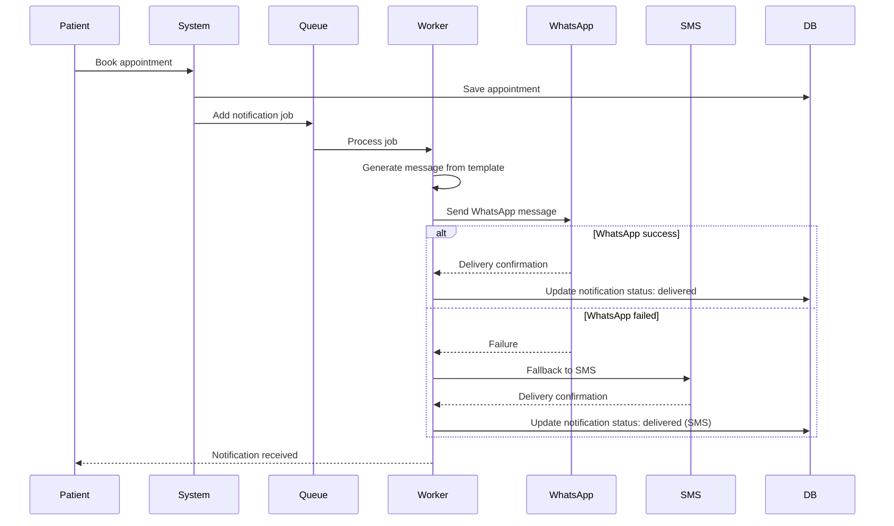

# Notification Architecture - WhatsApp & SMS Integration

## Overview
The notification system sends automated messages to patients via WhatsApp and SMS for appointment confirmations, reminders, and updates.

## Supported Channels

### 1. WhatsApp Business API
- **Provider**: Twilio, MessageBird, or WhatsApp Cloud API
- **Use Cases**: 
  - Appointment confirmations
  - Appointment reminders (24 hours before)
  - Appointment cancellations
  - Appointment rescheduling
- **Advantages**:
  - High engagement rate
  - Rich media support
  - Free for users
  - Popular in Egypt

### 2. SMS
- **Provider**: Twilio, Nexmo (Vonage), or local Egyptian providers
- **Use Cases**:
  - Fallback when WhatsApp unavailable
  - Critical notifications
  - OTP for verification
- **Advantages**:
  - Universal (no app required)
  - High delivery rate
  - Works on all phones

---

## Notification Flow



---

## Message Templates

### 1. Appointment Confirmation (Arabic)
```
مرحباً {patient_name} 👋

تم تأكيد حجز موعدك في {clinic_name}

📅 التاريخ: {appointment_date}
⏰ الوقت: {appointment_time}
📍 العنوان: {clinic_address}

نتطلع لرؤيتك!

للإلغاء أو التعديل، اتصل على: {clinic_phone}
```

### 2. Appointment Confirmation (English)
```
Hello {patient_name} 👋

Your appointment at {clinic_name} has been confirmed!

📅 Date: {appointment_date}
⏰ Time: {appointment_time}
📍 Address: {clinic_address}

We look forward to seeing you!

To cancel or reschedule, call: {clinic_phone}
```

### 3. Appointment Reminder (24 hours before)
```
تذكير بموعدك غداً 📅

{patient_name}، لديك موعد في {clinic_name}

⏰ غداً الساعة {appointment_time}
📍 {clinic_address}

نراك قريباً! 👋
```

### 4. Appointment Cancellation
```
إلغاء موعد ❌

عزيزي {patient_name}،

تم إلغاء موعدك في {clinic_name} المقرر في {appointment_date} الساعة {appointment_time}.

للحجز مرة أخرى، اتصل على: {clinic_phone}
```

### 5. Appointment Rescheduled
```
تعديل موعد 🔄

{patient_name}، تم تعديل موعدك

الموعد الجديد:
📅 {new_date}
⏰ {new_time}

📍 {clinic_name}
{clinic_address}
```

---

## Implementation Architecture

### 1. Queue-Based System (Recommended)

**Technology Stack:**
- **Queue**: Redis + Bull (Node.js) or Celery (Python)
- **Worker**: Separate process for sending notifications
- **Database**: PostgreSQL for notification logs

**Advantages:**
- Asynchronous processing
- Retry mechanism
- Scalable
- Doesn't block main application

**Flow:**
1. Appointment created → Add job to queue
2. Worker picks up job
3. Worker sends notification
4. Worker updates database with status
5. Retry on failure (max 3 attempts)

### 2. Direct API Calls (Simple)

**For MVP/Small Scale:**
- Send notification immediately after appointment creation
- Simpler implementation
- Good for low volume

**Disadvantages:**
- Blocks request
- No automatic retry
- Hard to scale

---

## WhatsApp Integration Options

### Option 1: Twilio WhatsApp API

**Setup:**
```javascript
const twilio = require('twilio');
const client = twilio(accountSid, authToken);

async function sendWhatsAppMessage(to, message) {
    try {
        const result = await client.messages.create({
            from: 'whatsapp:+14155238886', // Twilio sandbox
            to: `whatsapp:+2${to}`,        // Egyptian number
            body: message
        });
        return { success: true, messageId: result.sid };
    } catch (error) {
        return { success: false, error: error.message };
    }
}
```

**Pricing:**
- ~$0.005 per message
- Free sandbox for testing

### Option 2: WhatsApp Cloud API (Meta)

**Setup:**
```javascript
const axios = require('axios');

async function sendWhatsAppMessage(to, templateName, parameters) {
    const url = `https://graph.facebook.com/v17.0/${phoneNumberId}/messages`;
    
    try {
        const response = await axios.post(url, {
            messaging_product: 'whatsapp',
            to: to,
            type: 'template',
            template: {
                name: templateName,
                language: { code: 'ar' },
                components: [
                    {
                        type: 'body',
                        parameters: parameters
                    }
                ]
            }
        }, {
            headers: {
                'Authorization': `Bearer ${accessToken}`,
                'Content-Type': 'application/json'
            }
        });
        
        return { success: true, messageId: response.data.messages[0].id };
    } catch (error) {
        return { success: false, error: error.response.data };
    }
}
```

**Pricing:**
- Free for first 1000 conversations/month
- ~$0.01 per conversation after

**Requirements:**
- Facebook Business Account
- WhatsApp Business Account
- Approved message templates

---

## SMS Integration

### Twilio SMS

```javascript
async function sendSMS(to, message) {
    try {
        const result = await client.messages.create({
            from: twilioPhoneNumber,
            to: `+2${to}`,
            body: message
        });
        return { success: true, messageId: result.sid };
    } catch (error) {
        return { success: false, error: error.message };
    }
}
```

**Pricing:**
- Egypt: ~$0.04 per SMS

### Local Egyptian SMS Providers

**Options:**
- **Vodafone Egypt SMS Gateway**
- **Orange Egypt SMS API**
- **Etisalat Misr SMS Service**
- **Victory Link** (popular in Egypt)

**Advantages:**
- Lower cost for Egyptian numbers
- Better delivery rates locally
- Local support

---

## Notification Service Implementation

### Database Schema (Already in database-schema.sql)
```sql
CREATE TABLE notifications (
    id UUID PRIMARY KEY,
    clinic_id UUID NOT NULL,
    appointment_id UUID,
    recipient_phone VARCHAR(20) NOT NULL,
    notification_type VARCHAR(50) NOT NULL, -- whatsapp, sms
    message_template VARCHAR(50) NOT NULL,
    message_content TEXT NOT NULL,
    status VARCHAR(50) DEFAULT 'pending',   -- pending, sent, delivered, failed
    sent_at TIMESTAMP,
    delivered_at TIMESTAMP,
    error_message TEXT,
    created_at TIMESTAMP DEFAULT CURRENT_TIMESTAMP
);
```

### Notification Service Class

```javascript
class NotificationService {
    constructor() {
        this.whatsappProvider = new WhatsAppProvider();
        this.smsProvider = new SMSProvider();
    }
    
    async sendAppointmentConfirmation(appointment, clinic, patient) {
        const message = this.generateMessage('appointment_confirmation', {
            patient_name: patient.name,
            clinic_name: clinic.name,
            appointment_date: this.formatDate(appointment.date),
            appointment_time: this.formatTime(appointment.time),
            clinic_address: clinic.address,
            clinic_phone: clinic.phone
        });
        
        // Try WhatsApp first
        const whatsappResult = await this.whatsappProvider.send(
            patient.phone,
            message
        );
        
        if (whatsappResult.success) {
            await this.logNotification({
                clinicId: clinic.id,
                appointmentId: appointment.id,
                recipientPhone: patient.phone,
                recipientName: patient.name,
                notificationType: 'whatsapp',
                messageTemplate: 'appointment_confirmation',
                messageContent: message,
                status: 'sent'
            });
            return whatsappResult;
        }
        
        // Fallback to SMS
        const smsResult = await this.smsProvider.send(
            patient.phone,
            message
        );
        
        await this.logNotification({
            clinicId: clinic.id,
            appointmentId: appointment.id,
            recipientPhone: patient.phone,
            recipientName: patient.name,
            notificationType: 'sms',
            messageTemplate: 'appointment_confirmation',
            messageContent: message,
            status: smsResult.success ? 'sent' : 'failed',
            errorMessage: smsResult.error
        });
        
        return smsResult;
    }
    
    generateMessage(template, variables) {
        const templates = {
            appointment_confirmation: `مرحباً {patient_name} 👋\n\nتم تأكيد حجز موعدك في {clinic_name}\n\n📅 التاريخ: {appointment_date}\n⏰ الوقت: {appointment_time}\n📍 العنوان: {clinic_address}\n\nنتطلع لرؤيتك!\n\nللإلغاء أو التعديل، اتصل على: {clinic_phone}`,
            // ... other templates
        };
        
        let message = templates[template];
        for (const [key, value] of Object.entries(variables)) {
            message = message.replace(`{${key}}`, value);
        }
        return message;
    }
    
    async logNotification(data) {
        // Save to database
        await db.notifications.create(data);
    }
}
```

---

## Scheduled Reminders

### Using Cron Jobs

```javascript
const cron = require('node-cron');

// Run every hour to check for appointments needing reminders
cron.schedule('0 * * * *', async () => {
    const tomorrow = new Date();
    tomorrow.setDate(tomorrow.getDate() + 1);
    
    // Get appointments for tomorrow that haven't been reminded
    const appointments = await db.appointments.findAll({
        where: {
            appointment_date: tomorrow,
            reminder_sent: false,
            status: 'confirmed'
        },
        include: ['patient', 'clinic']
    });
    
    for (const appointment of appointments) {
        await notificationService.sendAppointmentReminder(
            appointment,
            appointment.clinic,
            appointment.patient
        );
        
        // Mark as reminded
        await appointment.update({ reminder_sent: true });
    }
});
```

---

## Cost Estimation

### For 100 appointments/day:

**WhatsApp (Twilio):**
- 100 confirmations × $0.005 = $0.50/day
- 100 reminders × $0.005 = $0.50/day
- **Total: $1/day = $30/month**

**WhatsApp Cloud API:**
- First 1000 free
- After: ~$10/month for 1000 messages

**SMS (Fallback):**
- Assume 10% fallback rate
- 20 SMS × $0.04 = $0.80/day
- **Total: $24/month**

**Combined: ~$54/month for 3000 messages**

---

## Best Practices

1. **Template Approval**: Get WhatsApp templates approved by Meta
2. **Opt-in**: Ensure patients consent to receive messages
3. **Timing**: Don't send messages late at night (after 9 PM)
4. **Retry Logic**: Max 3 retries with exponential backoff
5. **Monitoring**: Track delivery rates and failures
6. **Fallback**: Always have SMS as backup
7. **Localization**: Support Arabic and English
8. **Rate Limiting**: Respect provider limits
9. **Error Handling**: Log all failures for debugging
10. **Testing**: Use sandbox environments before production

---

## Environment Variables

```env
# Twilio
TWILIO_ACCOUNT_SID=your_account_sid
TWILIO_AUTH_TOKEN=your_auth_token
TWILIO_PHONE_NUMBER=+1234567890
TWILIO_WHATSAPP_NUMBER=whatsapp:+14155238886

# WhatsApp Cloud API
WHATSAPP_PHONE_NUMBER_ID=your_phone_number_id
WHATSAPP_ACCESS_TOKEN=your_access_token

# SMS Provider (if different)
SMS_PROVIDER_API_KEY=your_api_key
SMS_PROVIDER_SENDER_ID=ClinicApp

# Notification Settings
ENABLE_WHATSAPP=true
ENABLE_SMS=true
NOTIFICATION_RETRY_ATTEMPTS=3
NOTIFICATION_RETRY_DELAY=60000  # 1 minute in ms
```

---

## Future Enhancements

1. **Email Notifications**: For clinics with email addresses
2. **Push Notifications**: Mobile app integration
3. **Two-way Messaging**: Allow patients to reply
4. **Chatbot**: Automated responses for common questions
5. **Analytics**: Track open rates, click rates
6. **A/B Testing**: Test different message templates
7. **Personalization**: Based on patient history
8. **Multi-language**: Support more languages
